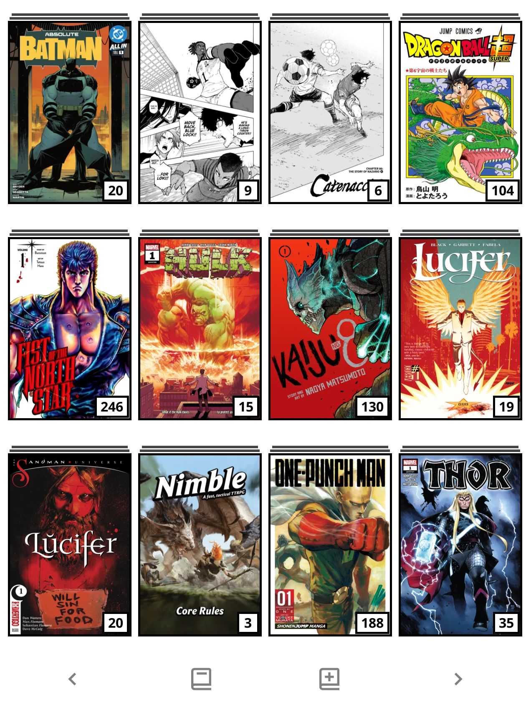

# KOReader Userpatches

A collection of [userpatches](https://github.com/koreader/koreader/wiki/User-patches) for [KOReader](https://koreader.rocks/).

## Goal

I wanted to reach this UI without relying on full overhaul plugins like [ProjectTitle](https://github.com/hius07/koreader-projecttitle). Each patch here is small, scoped, and toggleable, so the rest of KOReader stays stock.

## Installation

1. Locate (or create) the `patches/` folder inside your KOReader data directory:
   - **Kindle**: `/mnt/us/koreader/patches/`
   - **Kobo**: `<SD card>/kobo/.adds/koreader/patches/` or `<internal storage>/.adds/koreader/patches/`
   - **PocketBook**: `<SD card>/applications/koreader/patches/`
   - **Android**: `<storage>/Android/data/org.koreader.launcher/files/patches/`
2. Copy the desired `.lua` files into that folder.
3. Restart KOReader.

> **Note:** The `2-` prefix in the filename controls load order — patches starting with `2-` load after core KOReader code, which is required for monkey-patching. Do not rename the files.

## Patches

---

### Top Bar Editor

**File:** `2-top-bar-editor.lua`  
**Menu:** Settings → Top bar

Customizes the File Manager top bar title and right-side button.

#### Features

- **Hide top bar** — Removes the title bar entirely, giving the full screen height to the file list. The menu is still accessible by swiping down from the top edge.
- **Folder name as title** — Replaces the static "KOReader" text with the name of the current folder. Folders marked as shortcuts show a ☆ prefix.
- **Font styling** — Configurable font size, bold, and italic for the folder name. Hold the font size item to reset to default.
- **Right button action** — Remaps the top-right button tap to any KOReader dispatcher action (toggle Wi-Fi, open search, switch night mode, etc.) instead of opening the plus menu.
- **Right button icon** — Choose from several built-in icons for the right button (gear, menu, search, star, etc.).

#### Notes

- Changes apply immediately without a restart (the File Manager reinitialises in place).
- The action list is built from KOReader's dispatcher registry. Only simple (non-argument) actions are shown, since the button tap cannot supply a value.
- When file selection mode is active, the right button reverts to its default plus-menu behaviour regardless of the configured action.

---

### Pagination Bar Editor

**File:** `2-filemanager-pagination-bar-editor.lua`  
**Menu:** Settings → Pagination bar

Customizes the pagination bar that appears at the bottom of the file browser and reader menus.

#### Features

- **Text template** — Define what appears in the bar using tokens. Elements are rendered left-to-right in the order you write them:
  - Button tokens: `{first}` `{prev}` `{next}` `{last}`
  - Text tokens: `{page}` `{pages}` `{remaining}` `{space}`
  - Only buttons whose tokens are present in the template will be shown.
- **Font** — Configurable text size (10–36 pt) and bold.
- **Button style** — Icons (original chevrons) or dot characters (`••` `•` `•` `••`).
- **Button size** — Fixed size in pixels, or `0` for auto (40 px for icons; matches font size for dots).
- **Bar alignment** — Left, center, or right within the available width.
- **Spacer** — Adjustable gap (0–80 px) between each element.
- **Hide bar** — Hides the bar entirely. Swipe navigation still works when hidden.
- **Reset** — Restores all settings to their defaults.

#### Notes

- Most changes require a restart (a prompt appears automatically).
- The patch applies to all `Menu`-based views: the file browser, the reader table of contents, bookmarks, and similar menus.

---

### KOSync Sync All

**File:** `2-kosync-sync-all.lua`  
**Menu:** Progress sync → Sync all progress from this device

**Requires:** The [KOSync](https://github.com/koreader/koreader/tree/master/plugins/kosync.koplugin) plugin to be installed and configured with a server account.

Adds a bulk sync action to the Progress Sync plugin, pushing reading position for every book in your history to the server in one go.

#### Features

- Pushes reading progress for every book in history that has a recorded position.
- Shows a live progress counter (X / Y) while syncing.
- Displays a summary of pushed / failed / skipped counts when done.
- A detail view lists each failure reason and skipped book by filename.
- Respects the configured checksum method (filename or partial MD5), matching the behaviour of the per-book sync.
- Automatically skips the KOReader quickstart guide.

#### What "skipped" means

A book is skipped (not counted as a failure) when:
- The file no longer exists on the device.
- No reading progress has been recorded yet (book was never opened past the cover).
- A file digest (checksum) could not be computed.

#### Notes

- Only pushes progress *to* the server (device → server). It does not pull.
- An active internet connection is required; the patch will prompt you to connect if Wi-Fi is off.
- The menu item is disabled when no account is configured in the KOSync plugin settings.

---

## Third-party patches

The `third-party/` folder contains patches written by other authors that I use alongside my own. They're kept here only as a personal backup, in case of device loss or storage failure.

I have applied small local modifications to some of them: bug fixes (crashes, nil dereferences, unbounded caches), tweaks to defaults, and minor feature additions for personal preference. **These changes are not intended to interfere with the original projects' development flow** — please report issues and contribute upstream.

### Credits

- **`2-navbar-vos.lua`** — Bottom navigation bar with configurable tabs.  
  Original author: [SeriousHornet](https://github.com/SeriousHornet/KOReader.patches)

- **`2-browser-folder-cover.lua`** — Folder covers in the mosaic/list file browser.  
  **`2-browser-hide-underline.lua`** — Hides the "last visited" underline on covers.  
  **`2-browser-up-folder.lua`** — Adds Up/Home folder navigation and hide-empty-folder option.  
  **`2-screensaver-cover.lua`** — Extra options for the sleep screen.  
  Original author: [sebdelsol](https://github.com/sebdelsol/KOReader.patches)

If you are an author of one of these patches and would prefer this folder be removed, please open an issue and I will take it down.

---

## Compatibility

These patches are developed against recent stable KOReader releases and use the official userpatch API where possible. They rely on KOReader internals (widget APIs, dispatcher structure) that can change between releases. If KOReader updates its internals significantly, a patch may need to be updated.

## License

MIT — see individual file headers. Use at your own risk; these patches are not affiliated with or endorsed by the KOReader project.
